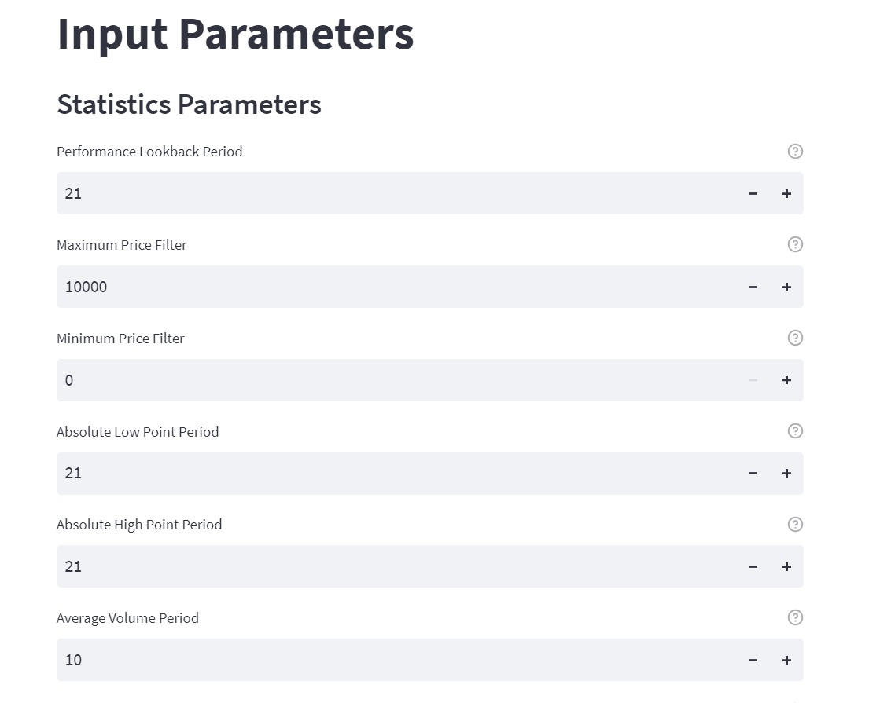

# Stock Screener/Filter  
 

## Objective 
A python script to filter out stocks between 10000+ stocks for some criteria. It uses streamlit to have a smooth UI. It collects stock data from yahoo finance.  
 

### filter_bot_funcs.py  
Contains the functions to calculate filtering conditions/criterias 

### webapp.py  
Streamlit app to make the application have a smooth UI. "stqdm" library helps visualizing progress bar in streamlit.
 

### Photo_1 
